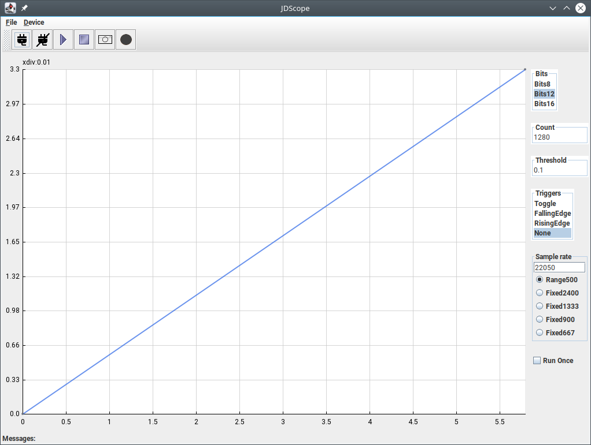

# STM32JDAQScope

A Gui for [GirinoSTM32F103duino](https://github.com/ag88/GirinoSTM32F103duino)



## Board

- Note this is mainly intended for the [blackpill_f401.bin](https://github.com/ag88/GirinoSTM32F103duino/tree/master/bin)) firmware targetting
[WeAct STM32F401 black pill](https://github.com/WeActStudio/WeActStudio.MiniSTM32F4x1) board. It needs to have a 25 Mhz crystal (not the 8 Mhz one)
- The Adc input pin is PA0

## Run

```
java -jar STM32JDAQScope.jar
```
In some systems (e.g. Windows), simply double clicking on the jar file launches it.

* note: The libs folder with jSerialComm-\*.jar should be a sub directory in the current directory

## LICENSE

APACHE 2 licensed.

However, dependent libraries e.g. jSerialComm are distributed under their own licenses
https://fazecast.github.io/jSerialComm/

